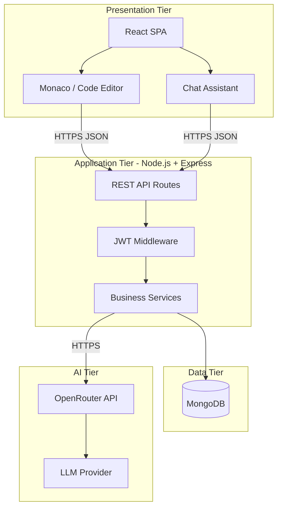
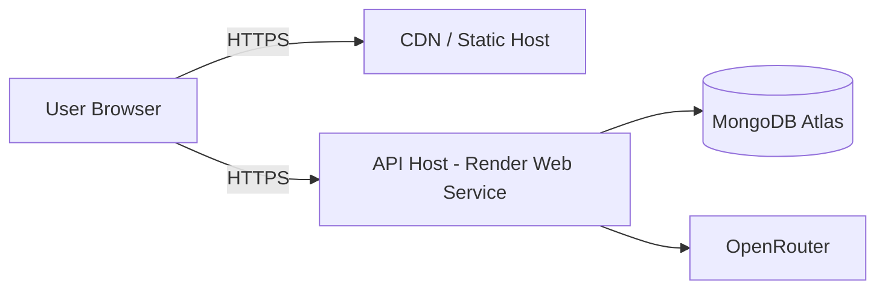
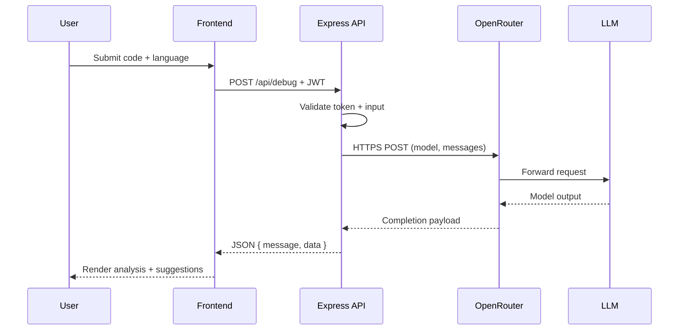
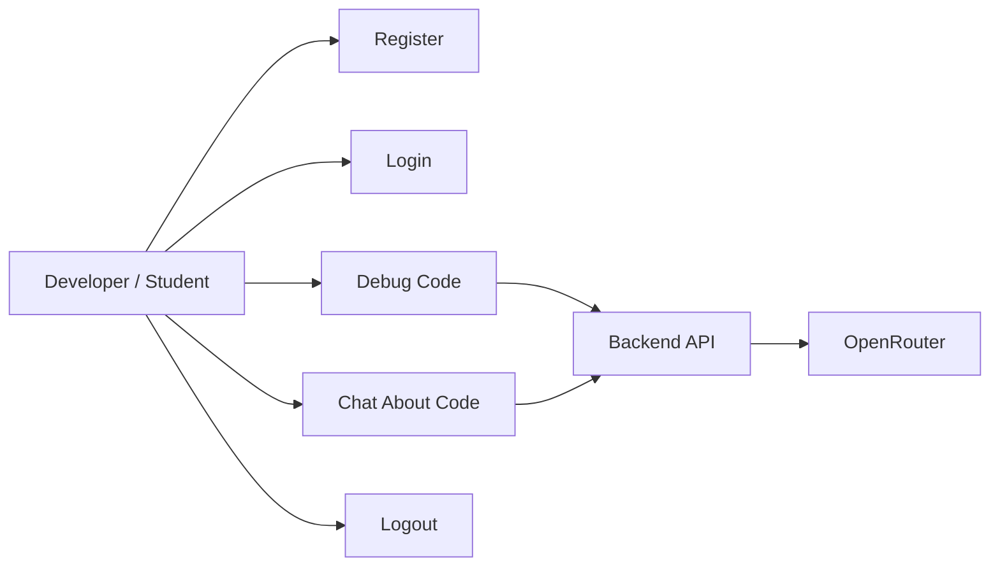
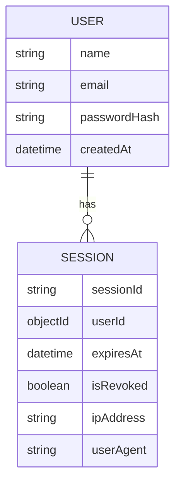
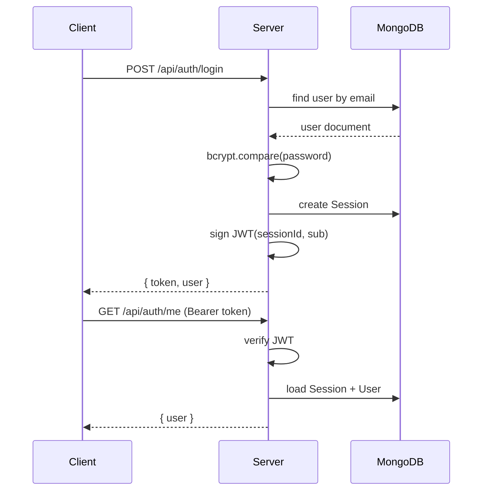

# AI Powered Code Debugger

## Final Year Project Documentation

**Course:** B.Tech Computer Science and Engineering  

**Student Name:** *[Placeholder — Full Name]*  

**Roll Number / Registration Number:** *[Placeholder]*  

**College / University:** *[Placeholder — Institution Name]*  

**Department:** Computer Science and Engineering  

**Academic Year:** *[Placeholder]*  

**Submitted To:** *[Placeholder — Guide / HOD]*  

**Date:** April 15, 2026  

---

## Certificate / Declaration *(Optional — insert institutional template)*

*[Placeholder: Standard certificate of originality and supervisor endorsement as per college format.]*

---

## Acknowledgement

*[Placeholder: Acknowledgements to guide, department, family, and open-source communities.]*

---

# Abstract

Software development is fundamentally an iterative process of writing, testing, and correcting programs. **Debugging**—the systematic identification and removal of defects—remains one of the most time-consuming activities in the software lifecycle. Traditional debugging relies heavily on developer experience, static compiler or interpreter messages, and interactive tools such as breakpoints and step-through execution. While effective for experts, these approaches often overwhelm beginners, obscure root causes behind terse error messages, and scale poorly when developers work across multiple languages or unfamiliar frameworks.

**AI Powered Code Debugger** is a full-stack web application that combines a modern interactive front end, a secure RESTful backend, and a **large language model (LLM)** accessed through the **OpenRouter** unified API. The system accepts source code and a selected programming language, forwards the material to the AI layer with carefully engineered prompts, and returns structured analysis: plain-language explanations of failures, likely root causes, corrected code suggestions, and optional conversational follow-up through a chat-style assistant.

The project demonstrates how **natural language understanding** and **code-aware generative models** can complement classical tooling by:

- Reducing the **cognitive load** on novice programmers through explanatory narratives rather than raw stack traces alone.
- Accelerating **hypothesis generation** about bugs (e.g., typos, logic errors, API misuse) across languages supported by the model.
- Providing a **consistent interaction model** (editor → analyze → explain) independent of IDE-specific plugins.

The architecture separates concerns: the **React**-based client handles user experience and editor integration; **Node.js** with **Express** orchestrates authentication, persistence, and outbound calls to OpenRouter; **MongoDB** stores user and session-related data where applicable; **JWT** secures API routes. The solution is designed for deployment on managed platforms (e.g., **Render** or analogous PaaS offerings), emphasizing environment-based configuration and scalable stateless API design.

This documentation presents the problem context, objectives, literature review, detailed system design, implementation notes, evaluation, limitations, and future work—suitable for academic assessment of a final-year capstone in Computer Science.

**Keywords:** Artificial intelligence, large language models, software debugging, full-stack web development, OpenRouter, React, Node.js, Express, MongoDB, JWT, prompt engineering.

---

# Table of Contents

1. [Introduction](#1-introduction)  
2. [Problem Statement](#2-problem-statement)  
3. [Objectives](#3-objectives)  
4. [Literature Survey](#4-literature-survey)  
5. [System Architecture](#5-system-architecture)  
6. [Technology Stack](#6-technology-stack)  
7. [Working Principle](#7-working-principle)  
8. [Implementation Details](#8-implementation-details)  
9. [Features](#9-features)  
10. [Screenshots](#10-screenshots)  
11. [Advantages](#11-advantages)  
12. [Limitations](#12-limitations)  
13. [Future Scope](#13-future-scope)  
14. [Conclusion](#14-conclusion)  
15. [References](#15-references)  
16. [Appendices](#16-appendices)  
17. [Software Requirements Specification](#17-software-requirements-specification)  
18. [Detailed Design](#18-detailed-design)  
19. [Testing Strategy and Results](#19-testing-strategy-and-results)  
20. [Results, Discussion, and Evaluation](#20-results-discussion-and-evaluation)  

---

# 1. Introduction

## 1.1 What Is Debugging?

**Debugging** is the process of locating, analyzing, and correcting **defects** (bugs) in software so that the program behaves according to its specification. Debugging activities include:

- Reproducing the failure under controlled conditions.  
- Forming hypotheses about the fault (syntax, logic, environment, concurrency, etc.).  
- Instrumenting code or using breakpoints to narrow the fault region.  
- Applying a fix and **regression testing** to ensure no new defects are introduced.

Debugging is distinct from **testing** (which aims to reveal failures) but tightly coupled to it: failed tests and runtime exceptions are typical starting points for a debugging session.

## 1.2 Traditional Debugging Challenges

Classical debugging workflows—whether using print statements, debuggers (GDB, Visual Studio Debugger), or IDE-integrated tools—present recurring challenges:

| Challenge | Description |
|-----------|-------------|
| **Expertise gradient** | Novices struggle to interpret compiler errors, especially in C++ templates or dynamic languages with runtime-only failures. |
| **Context switching** | Developers must map abstract error text to concrete source lines and mental models of execution. |
| **Cross-language friction** | Syntax and tooling differ across languages; expertise in one ecosystem does not fully transfer. |
| **Time cost** | Industry studies consistently report debugging and maintenance consuming a large fraction of developer time. |
| **Hidden assumptions** | Off-by-one errors, null dereferences, and asynchronous races are not always obvious from static messages. |

## 1.3 Need for Automation and Intelligent Assistance

Automation in debugging spans **static analysis**, **symbolic execution**, **fuzzing**, and **automated test generation**. These techniques are powerful but often require configuration, produce false positives, or demand specialized knowledge.

Recent advances in **machine learning** and **large language models** trained on vast corpora of code and natural language enable a new class of tools: systems that **read code and error context** and **generate human-readable diagnoses** and **patch suggestions**. Such tools do not replace formal verification or expert review but can **lower the barrier to entry** and **accelerate early triage**.

## 1.4 Introduction to AI-Based Debugging Systems

AI-based debugging assistants typically:

1. **Ingest** source code, optional error messages, logs, and language metadata.  
2. **Construct prompts** that constrain the model to produce structured outputs (explanation, fix, tests).  
3. **Post-process** model output for safety, formatting, and integration into the IDE or web UI.  
4. **Iterate** through conversational follow-ups (“Why did you suggest this change?”).

**AI Powered Code Debugger** fits this paradigm: it exposes debugging and chat endpoints backed by OpenRouter-accessible models, wrapped in a secure web application suitable for demonstration and real use.

---

# 2. Problem Statement

Despite the maturity of compilers and IDEs, many developers—particularly students and junior engineers—face persistent obstacles:

1. **Manual debugging is slow.** Tracing control flow and inspecting state for non-trivial programs consumes hours.  
2. **Error messages are not always pedagogical.** They identify *what* failed but not always *why* in terms a beginner understands.  
3. **Complexity grows with code size and dependencies.** Modern applications rely on frameworks where failures may originate in distant modules.  
4. **Traditional tools lack conversational guidance.** They rarely suggest refactors or explain design trade-offs interactively.  
5. **Onboarding new team members** to a codebase is hindered without mentors readily available.

There is a need for an **accessible, web-based system** that:

- Accepts code in **multiple languages** (subject to model capability).  
- Returns **structured AI analysis** with explanations and suggested fixes.  
- Supports **optional chat** for follow-up questions.  
- Operates behind **authentication** and **secure API** practices for realistic deployment.

**AI Powered Code Debugger** addresses this gap by integrating LLM-based analysis into a full-stack architecture deployable on cloud platforms.

---

# 3. Objectives

## 3.1 Primary Objectives

1. **Design and implement** a full-stack **AI Powered Code Debugger** web application.  
2. **Automate error detection and explanation** by leveraging LLMs via **OpenRouter**.  
3. **Suggest corrections** and improved code snippets where feasible.  
4. **Provide beginner-friendly narratives** that complement raw compiler/interpreter output.  

## 3.2 Secondary Objectives

1. Implement **secure user authentication** (JWT) and **password hashing** (bcrypt).  
2. Use **MongoDB** for persistent user/session-related data where required.  
3. Ensure **modular architecture** (clear separation of frontend, backend, AI service layer).  
4. Support **cloud deployment** (e.g., **Render** or equivalent PaaS) with **environment-based configuration**.  
5. Document the system for **academic evaluation** and **reproducibility**.

## 3.3 Measurable Outcomes

| Outcome | Indicator |
|---------|-----------|
| Functional web UI | Users can submit code and view AI output. |
| API reliability | Health and error endpoints return consistent JSON. |
| Security baseline | Protected routes require valid JWT; secrets not hard-coded. |
| Extensibility | Adding a new model or language is primarily configuration + prompt change. |

---

# 4. Literature Survey

## 4.1 Classical Debugging and Tooling

Historically, debugging research and practice focused on:

- **Interactive debuggers** (breakpoints, watch windows).  
- **Static analyzers** (linting, type checking, abstract interpretation).  
- **Dynamic analysis** (sanitizers, profilers).  

These tools excel at **precision** when configured correctly but may **overwhelm** users with warnings or require expert tuning.

## 4.2 Static vs. AI-Assisted Debugging

| Aspect | Static / Traditional | AI-Assisted |
|--------|----------------------|-------------|
| **Basis** | Formal rules, symbolic reasoning, heuristics | Statistical patterns from large training corpora |
| **Strengths** | Deterministic feedback; proven soundness in narrow domains | Natural language explanations; cross-language analogies |
| **Weaknesses** | Steep learning curve; brittle configuration | May hallucinate; requires guardrails and validation |
| **Best use** | Safety-critical code; CI gates | Triage, education, draft fixes |

## 4.3 Large Language Models for Code

LLMs pretrained on code (e.g., families accessible via OpenRouter) can:

- Predict **missing tokens** and **complete** partial programs.  
- **Explain** code in natural language.  
- **Translate** between languages at a syntactic level.  
- Propose **refactors** and **tests** when prompted with sufficient context.

Academic and industrial literature highlights both **productivity gains** and **risks** (incorrect suggestions, license/training data concerns). Responsible systems combine AI output with **human review** and **automated checks** (lint, test execution).

## 4.4 Related Commercial and Research Systems

*[Academic narrative:]* GitHub Copilot, ChatGPT Code Interpreter, and research prototypes (e.g., LLM-assisted patch generation) demonstrate market and research interest. **AI Powered Code Debugger** differs by being a **focused educational/demonstration stack** with explicit **REST APIs**, **JWT-secured** access, and **transparent prompt-driven** behavior suitable for project evaluation.

## 4.5 Gap Addressed by This Project

Many AI coding tools are **closed ecosystems** or IDE-locked. This project provides a **transparent, customizable** pipeline: open-source stack, documented environment variables, and clear extension points for prompts and models.

---

# 5. System Architecture

## 5.1 Architectural Overview

The system follows a **three-tier** pattern:

1. **Presentation tier:** React SPA, code editor, chat UI.  
2. **Application tier:** Node.js + Express REST API, authentication, orchestration.  
3. **Data & intelligence tier:** MongoDB persistence; OpenRouter LLM API.



## 5.2 Component Responsibilities

| Component | Responsibility |
|-----------|------------------|
| **React client** | Routing, state management, editor UX, API calls. |
| **Express server** | `/api/debug`, `/api/chat`, `/api/auth/*`, `/api/health`. |
| **Auth middleware** | Validates JWT, loads session/user context. |
| **OpenRouter service** | Builds prompts, calls external API, parses responses. |
| **MongoDB** | Users, sessions, optional history. |

## 5.3 Deployment Architecture (Example: Render)



*Note: Equivalent deployments may use Railway, Vercel, or other PaaS; the principle is **stateless API** + **managed database** + **environment secrets**.*

## 5.4 Security Architecture (High Level)

- **Transport:** TLS (HTTPS) end-to-end on production.  
- **Authentication:** JWT in `Authorization: Bearer` header for protected routes.  
- **Password storage:** bcrypt hashing (cost factor appropriate to deployment).  
- **Secrets:** `JWT_SECRET`, `OPENROUTER_API_KEY`, `MONGODB_URI` supplied via environment variables only.

---

# 6. Technology Stack

## 6.1 Frontend

### 6.1.1 React.js

**React** is a declarative JavaScript library for building user interfaces, maintained by Meta. It models UI as a function of **state** and uses a **virtual DOM** to efficiently reconcile updates.

**Why React for this project?**

- **Component reusability:** Editor panels, chat bubbles, and navigation can be composed cleanly.  
- **Ecosystem:** Rich integration with routers, bundlers, and editor widgets.  
- **Industry adoption:** Aligns with workforce skills and documentation availability.

**Advantages:**

- Strong community, tooling (ESLint, dev servers), and patterns (hooks).  
- Facilitates **single-page applications (SPAs)** with client-side routing.

### 6.1.2 Vite *(Modern build tool — often paired with React)*

While the academic brief cites React broadly, many contemporary projects use **Vite** for fast HMR and optimized production builds. Vite uses native ES modules during development and Rollup/esbuild for bundling—improving developer experience for capstone iteration.

### 6.1.3 Tailwind CSS

**Tailwind CSS** is a **utility-first** CSS framework. Instead of writing large custom stylesheets, developers apply small, composable utility classes (spacing, color, flexbox) directly in markup.

**Why Tailwind?**

- Rapid UI iteration for academic timelines.  
- Consistent design tokens (spacing scale, typography).  
- Responsive modifiers (`sm:`, `md:`) suit multi-device demos.

### 6.1.4 Axios and HTTP Communication

**Axios** is a popular **Promise-based HTTP client** for browsers and Node.js. Features include interceptors, automatic JSON transformation, and configurable timeouts.

**Role in API communication:**

```text
Client  --(Axios/fetch)-->  POST /api/debug  { code, language }
Client  <-- JSON response --  { explanation, fixes, ... }
```

*Implementation note:* Some codebases use the **Fetch API** natively; Axios is functionally equivalent for REST JSON calls and is widely taught alongside React.

### 6.1.5 Monaco Editor *(or similar)*

A browser-based code editor provides **syntax highlighting** and familiar keybindings, improving usability for debugging demonstrations.

---

## 6.2 Backend

### 6.2.1 Node.js

**Node.js** is a JavaScript **runtime** built on Chrome’s V8 engine, enabling server-side execution of JavaScript. Its **non-blocking I/O** model suits concurrent HTTP workloads typical of API servers.

### 6.2.2 Express.js

**Express** is a minimal, flexible **web framework** for Node.js. It provides routing, middleware chaining, and HTTP helpers.

**Why Express?**

- Mature ecosystem and middleware (CORS, JSON body parsers).  
- Straightforward mapping from **REST resources** to **route handlers**.  
- Suitable for academic projects and production prototypes alike.

**Typical middleware stack:**

```text
Request → CORS → JSON parser → Auth (optional) → Route handler → Error handler → Response
```

---

## 6.3 AI Integration — OpenRouter API

### 6.3.1 What Is OpenRouter?

**OpenRouter** is a **unified API gateway** to multiple LLM providers and models. Clients send HTTP requests with standard headers and JSON bodies; OpenRouter routes to the selected model.

### 6.3.2 How It Works (Conceptual)

1. Backend loads `OPENROUTER_API_KEY` from environment.  
2. Backend selects `OPENROUTER_MODEL` (e.g., a GPT-class or open model slug).  
3. Backend sends a **chat completion**-style payload: system instructions + user content (code + question).  
4. OpenRouter returns **token streams** or **complete messages**; backend extracts assistant text.  
5. Backend shapes assistant text into application JSON (`data` fields).

### 6.3.3 Request / Response Flow



### 6.3.4 Prompt Engineering

**Prompt engineering** is the disciplined design of inputs to LLMs to maximize useful, reliable outputs. Strategies used in debugging contexts:

| Technique | Purpose |
|-----------|---------|
| **System prompt** | Define role (“expert debugger”), output format, safety rules. |
| **Delimiters** | Separate code from instructions using fences or tags. |
| **Structured output request** | Ask for sections: Summary, Root cause, Fix, Corrected code. |
| **Language hint** | Explicitly state language to reduce model confusion. |
| **Constraint** | Forbid executing user code server-side; analysis only. |

Example *conceptual* prompt skeleton:

```text
System: You are an expert programming tutor. Explain errors clearly. Do not execute code.

User:
Language: JavaScript
Code:
```javascript
// user code here
```

Task: Identify bugs, explain them, suggest a fix, provide corrected code in a fenced block.
```

---

## 6.4 Database — MongoDB

**MongoDB** is a **document-oriented NoSQL** database. For this project it may store:

- **User documents** (email, name, password hash).  
- **Session documents** (session id, expiry, revocation flag, metadata).  
- **Optional history** (past debug requests for analytics or UX).

**Why MongoDB?**

- Flexible schema for evolving capstone features.  
- Managed **MongoDB Atlas** integrates cleanly with cloud hosts.  
- Mongoose ODM provides schema validation in Node.js.

---

## 6.5 Authentication

### 6.5.1 JWT (JSON Web Token)

**JWT** is a compact, URL-safe token format (header.payload.signature). After login, the server issues a JWT embedding claims (`sub`, `sessionId`, etc.). Clients attach:

```http
Authorization: Bearer <token>
```

**Advantages:**

- Stateless verification (signature with `JWT_SECRET`).  
- Works well with SPAs and mobile clients.

**Considerations:**

- Short-lived tokens + refresh strategies for production hardening.  
- Secure storage on client (prefer HTTP-only cookies for highest security; localStorage is common in demos but XSS-sensitive).

### 6.5.2 bcrypt (Password Hashing)

**bcrypt** adapts hashing cost to resist brute-force attacks. Passwords are **never** stored in plaintext.

---

## 6.6 Deployment — Render

**Render** is a **Platform-as-a-Service (PaaS)** offering static sites, web services, and background workers. A typical deployment:

1. Connect Git repository.  
2. Define **build command** (e.g., `npm install && npm run build` for frontend).  
3. Define **start command** for API (`node index.js` or `npm start`).  
4. Configure **environment variables** in the Render dashboard.  
5. Attach **MongoDB Atlas** connection string.

**Operational practices:**

- Separate **preview** and **production** environments.  
- Enable **auto-deploy** on main branch.  
- Monitor logs and set alerts for 5xx rates.

---

# 7. Working Principle

## 7.1 End-to-End Flow

1. **User registration / login**  
   - Client posts credentials to `/api/auth/signup` or `/api/auth/login`.  
   - Server validates input, hashes passwords (signup), verifies (login), creates session, returns JWT.

2. **Workspace access**  
   - Client stores JWT and attaches it to protected requests.

3. **Code debugging**  
   - User selects language and pastes code.  
   - Client sends `POST /api/debug` with JSON body `{ code, language }`.  
   - Server verifies JWT, optionally loads user context, forwards payload to **OpenRouter service**.  
   - AI returns natural language analysis; server wraps in uniform JSON.

4. **Chat assistance**  
   - User asks follow-up questions; client sends `POST /api/chat` with code context + history.  
   - Server includes **conversation history** in prompt (within token limits).

5. **Response rendering**  
   - Client displays sections: summary, errors, suggested fix, code diff or block.

## 7.2 How the AI “Analyzes” Code (Conceptual)

The model does not execute the user program by default. Instead it:

- **Tokenizes** and **patterns** the source against training distribution.  
- **Predicts** likely mistakes (e.g., undefined variables, wrong function names).  
- **Generates** explanatory text conditioned on the prompt.

This is **heuristic**, not **formally verified**. Best practice is to **run tests** or **lint** after applying suggestions.

---

# 8. Implementation Details

## 8.1 Frontend Structure *(Representative)*

```text
client/
  src/
    App.jsx                 # Routes, global state, API base URL
    main.jsx                # Entry, providers
    components/
      WorkspacePage.jsx     # Editor + layout
      CodeEditor.jsx        # Monaco integration
      ChatAssistant.jsx     # Chat UI
      Navbar.jsx
      ...
  vite.config.js            # Dev server, proxy, build
  package.json
```

**Environment variables (Vite):**

| Variable | Purpose |
|----------|---------|
| `VITE_API_BASE_URL` | Backend base URL or relative path for same-origin deployment |

## 8.2 Backend API Structure *(Representative)*

```text
server/
  src/
    app.js                  # Express app, CORS, static (if any)
    server.js               # listen()
    routes/index.js         # Route table
    controllers/            # debugController, chatController, authController
    services/               # openRouterService, authService
    middleware/             # auth, errors
    models/                 # User, Session, ...
    config/db.js            # Mongo connection
  package.json
```

## 8.3 Representative API Endpoints

| Method | Path | Auth | Description |
|--------|------|------|-------------|
| GET | `/api/health` | No | Liveness / status |
| POST | `/api/auth/signup` | No | Register |
| POST | `/api/auth/login` | No | Login |
| GET | `/api/auth/me` | Yes | Current user |
| POST | `/api/debug` | Yes | AI debug |
| POST | `/api/chat` | Yes | AI chat |

## 8.4 AI Request Logic

1. Validate **API key** presence (`OPENROUTER_API_KEY`).  
2. Build **messages array** for chat completion.  
3. Set **model** from `OPENROUTER_MODEL`.  
4. Handle **timeouts** and **rate limits** with user-friendly errors.  
5. Parse model output; on failure return structured error JSON.

## 8.5 Environment Variables *(Illustrative)*

| Variable | Layer | Purpose |
|----------|-------|---------|
| `CLIENT_URL` | Server | CORS allowlist |
| `JWT_SECRET` | Server | Sign JWT |
| `JWT_EXPIRES_IN` | Server | Token lifetime |
| `MONGODB_URI` | Server | Database connection |
| `OPENROUTER_API_KEY` | Server | AI authentication |
| `OPENROUTER_MODEL` | Server | Model selection |
| `NODE_ENV` | Server | `production` / `development` |

## 8.6 Error Handling

- **Central error middleware** returns JSON `{ success: false, message }`.  
- **Validation errors** use HTTP 400.  
- **Auth errors** use HTTP 401.  
- **Upstream AI errors** map to 502/503 with safe messages.  
- **Database guard** may return 503 if DB unavailable (implementation-dependent).

## 8.7 Security Notes

- Never commit `.env` to version control.  
- Rotate API keys if exposed.  
- Use HTTPS in production.  
- Rate-limit auth endpoints in real deployments.

---

# 9. Features

| Feature | Description |
|---------|-------------|
| **Code editor** | Syntax-aware editing experience in browser. |
| **Language selection** | Dropdown for language context in prompts. |
| **AI-based debugging** | One-click analysis of pasted code. |
| **Error explanation** | Plain-language breakdown for learners. |
| **Suggested fixes** | Corrected code or patch-style suggestions. |
| **Chat assistant** | Follow-up Q&A grounded in current code snippet. |
| **Authentication** | Sign up / sign in / session validation. |
| **Theme / UX** | Polished UI via Tailwind utilities. |

---

# 10. Screenshots

*[Insert figures as per institutional guidelines. Placeholders below.]*

## 10.1 Home / Login Page

  
*Figure 10.1: Login and authentication entry screen.*

## 10.2 Workspace — Code Editor

  
*Figure 10.2: Main debugging workspace with language selector and editor.*

## 10.3 AI Analysis Output

  
*Figure 10.3: Structured AI analysis and suggested corrections.*

## 10.4 Chat Assistant

  
*Figure 10.4: Conversational assistance panel.*

---

# 11. Advantages

1. **Accelerated triage** of syntax and common logic errors.  
2. **Educational value** through explanations, not only fixes.  
3. **Unified web UX** accessible without IDE plugins.  
4. **Extensible architecture** for new models and languages.  
5. **Modern security practices** (JWT, bcrypt, environment secrets).  

---

# 12. Limitations

1. **Internet dependency** for LLM API availability.  
2. **API cost and quotas** on OpenRouter / provider accounts.  
3. **Model hallucination risk**—suggestions may be incorrect or unsafe.  
4. **No guarantee of executing** or **verifying** fixes without external test runs.  
5. **Data privacy:** code is transmitted to third-party AI services unless self-hosted models are used.  
6. **Latency** varies with model size and provider load.  

---

# 13. Future Scope

1. **Broader language support** and per-language linters integrated pre/post AI.  
2. **Real-time collaborative debugging** (shared sessions, annotations).  
3. **VS Code / JetBrains extension** using the same backend APIs.  
4. **Execution sandbox** for safe test runs of snippets (strong isolation required).  
5. **Fine-tuned models** on curated bug-fix datasets for improved precision.  
6. **Team workspaces** with role-based access and audit logs.  
7. **On-prem / air-gapped** deployment with open-weights models.  

---

# 14. Conclusion

**AI Powered Code Debugger** demonstrates a practical convergence of **software engineering**, **web systems**, and **artificial intelligence**. By integrating OpenRouter-backed LLMs into a secure Express API and a responsive React client, the project addresses real pain points in manual debugging—especially for learners—while maintaining clear architectural boundaries suitable for maintenance and extension.

The work underscores that AI is best positioned as a **collaborative assistant** that augments human judgment rather than replacing disciplined engineering practices such as testing, code review, and version control. Future iterations can harden security, deepen evaluation metrics, and integrate execution-backed verification to narrow the gap between **suggested** and **proven** fixes.

---

# 15. References

1. React Documentation. *https://react.dev/*  
2. Vite Documentation. *https://vitejs.dev/*  
3. Tailwind CSS Documentation. *https://tailwindcss.com/*  
4. Axios Documentation. *https://axios-http.com/*  
5. Node.js Documentation. *https://nodejs.org/docs/*  
6. Express.js Documentation. *https://expressjs.com/*  
7. OpenRouter Documentation. *https://openrouter.ai/docs*  
8. MongoDB Documentation. *https://www.mongodb.com/docs/*  
9. Mongoose Documentation. *https://mongoosejs.com/docs/*  
10. JWT Introduction (RFC 7519 context). *https://datatracker.ietf.org/doc/html/rfc7519*  
11. bcrypt. *https://github.com/kelektiv/node.bcrypt.js*  
12. Render Documentation. *https://render.com/docs*  

---

# 16. Appendices

## Appendix A: Glossary

| Term | Definition |
|------|------------|
| **LLM** | Large Language Model; generative model trained on text/code. |
| **REST** | Architectural style using HTTP verbs and resource URLs. |
| **SPA** | Single Page Application; dynamic client-side routing. |
| **CORS** | Cross-Origin Resource Sharing; browser security mechanism. |
| **ODM** | Object Document Mapper (e.g., Mongoose for MongoDB). |

## Appendix B: Sample API Payloads *(Illustrative)*

**Debug request:**

```json
{
  "code": "function greet(name) { return `Hello ${name}` }\nconsole.log(gret('World'))",
  "language": "javascript"
}
```

**Debug response (conceptual):**

```json
{
  "success": true,
  "message": "Analysis complete.",
  "data": {
    "summary": "Typo in function name gret vs greet.",
    "suggestions": ["Rename gret to greet"],
    "correctedCode": "function greet(name) { return `Hello ${name}` }\nconsole.log(greet('World'))"
  }
}
```

## Appendix C: Risk & Ethics Statement

- Users should **avoid pasting secrets** (API keys, passwords) into AI tools.  
- Academic use should document **third-party data processing** policies.  
- Model outputs should be **critically evaluated** before merging to production codebases.

## Appendix D: Project Timeline *(Placeholder)*

| Phase | Duration | Milestone |
|-------|----------|-----------|
| Requirements | Week 1–2 | Problem definition |
| Design | Week 3–4 | Architecture & UI mockups |
| Implementation | Week 5–10 | MVP + auth + AI |
| Testing | Week 11–12 | Functional & security checks |
| Documentation | Week 13–14 | Report & demo |

## Appendix E: Abbreviated User Guide

1. Open the deployed application URL in a modern browser (Chrome, Edge, Firefox).  
2. **Sign up** with name, email, and password (minimum length per server validation).  
3. **Sign in** and open the **workspace**.  
4. Select **programming language** from the dropdown.  
5. Paste or type code in the **editor**.  
6. Click **Debug Code** to request AI analysis; review output in the **output panel**.  
7. Use the **chat assistant** for follow-up questions about the same snippet.  
8. **Sign out** when finished on shared devices.  

**Do not** paste production secrets, credentials, or proprietary code without organizational approval.

---

# 17. Software Requirements Specification

## 17.1 Purpose and Scope

This section specifies functional and non-functional requirements for **AI Powered Code Debugger** as a capstone software system. The scope includes:

- Web-based user interface for code entry, language selection, AI debugging, and chat.  
- Backend REST API for authentication, debugging, chat, and health monitoring.  
- Integration with **OpenRouter** for LLM inference.  
- Optional persistence of users and sessions in **MongoDB**.  

Out of scope (unless extended in future work): native mobile apps, execution of untrusted user code in a sandbox, and formal verification of patches.

## 17.2 Stakeholders

| Stakeholder | Interest |
|-------------|----------|
| **Students / developers** | Faster understanding of bugs; learning support. |
| **Project guide / evaluators** | Reproducible demo; clear documentation. |
| **System administrator** | Secure deployment; secret rotation; monitoring. |

## 17.3 Functional Requirements

| ID | Requirement | Priority |
|----|-------------|----------|
| FR-1 | User can register with name, email, password | High |
| FR-2 | User can log in and receive a session token (JWT) | High |
| FR-3 | User can view authenticated workspace | High |
| FR-4 | User can submit code + language for AI analysis | High |
| FR-5 | System returns explanation and suggested fix text | High |
| FR-6 | User can chat about current code with context | Medium |
| FR-7 | User can log out / invalidate session server-side | Medium |
| FR-8 | System exposes health endpoint for monitoring | Medium |

## 17.4 Non-Functional Requirements

| ID | Requirement | Target |
|----|-------------|--------|
| NFR-1 | **Availability** | Demo-grade uptime on managed hosting |
| NFR-2 | **Security** | HTTPS; hashed passwords; JWT for API auth |
| NFR-3 | **Performance** | Reasonable latency subject to LLM provider |
| NFR-4 | **Maintainability** | Modular controllers/services |
| NFR-5 | **Usability** | Responsive layout; clear error messages |

## 17.5 Use Cases *(Summary)*



## 17.6 Constraints and Assumptions

- **Assumption:** Users have stable internet connectivity.  
- **Assumption:** OpenRouter account and API key are provisioned by the deployer.  
- **Constraint:** Model context window limits the size of pasted code and chat history.  
- **Constraint:** Third-party AI processing may apply data handling policies independent of this project.

---

# 18. Detailed Design

## 18.1 Logical Layering

| Layer | Artifacts |
|-------|-----------|
| **Presentation** | React components, routing, client-side state |
| **Application** | Express routes, controllers, validation |
| **Domain** | Auth session lifecycle, user model rules |
| **Infrastructure** | MongoDB adapter, HTTP client to OpenRouter |

## 18.2 Data Model *(Conceptual)*



*Note: Exact field names align with Mongoose schemas in implementation.*

## 18.3 Authentication and Session Flow



## 18.4 Debug and Chat Controller Responsibilities

- **Input validation:** reject empty code; cap payload size (e.g., 1 MB JSON limit).  
- **Authorization:** ensure `authenticateUser` ran successfully.  
- **Service invocation:** call OpenRouter wrapper with constructed messages.  
- **Response normalization:** map provider errors to stable API error schema.  

## 18.5 Prompt Construction Strategy

Debugging prompts typically include:

1. **System message:** role, safety, output structure.  
2. **User message:** language, code block, optional compiler/runtime error text (future).  
3. **Assistant follow-ups (chat):** prior turns trimmed to fit token budget.  

**Token budgeting:** truncate history from the oldest messages first while retaining the latest user question and the current code snapshot.

## 18.6 Deployment Topology Variants

| Variant | Frontend | Backend | Notes |
|---------|----------|---------|-------|
| **Split** | Static host / CDN | Render web service | Classic separation |
| **Unified PaaS** | Same provider | Serverless functions + static | Fewer moving parts |
| **Monorepo** | Build step publishes `client/build` | API process or function bundle | Used in many academic demos |

The academic narrative emphasizes **Render** for the API tier while acknowledging equivalent platforms.

---

# 19. Testing Strategy and Results

## 19.1 Testing Levels

### 19.1.1 Unit Testing *(Recommended)*

- Password hashing and comparison utilities.  
- JWT issue/verify with known secrets in test environment.  
- Prompt builder pure functions (if extracted).  

### 19.1.2 Integration Testing

- `POST /api/auth/signup` → user persisted → duplicate email returns 409.  
- `POST /api/login` → invalid password returns 401.  
- `POST /api/debug` without token returns 401.  
- `GET /api/health` returns 200 with JSON schema.  

### 19.1.3 Manual / System Testing

- Cross-browser checks (Chrome, Edge).  
- Mobile responsive layout smoke test.  
- AI latency and timeout behavior under slow networks.  

### 19.1.4 Security Testing *(Checklist)*

| Check | Expected |
|-------|----------|
| Secrets only in env | No keys in repository |
| CORS | Only approved origins in production config |
| JWT tampering | Rejected by signature verification |
| Rate limiting | *(Future)* throttle auth endpoints |

## 19.2 Sample Test Cases *(Illustrative)*

| TC-ID | Scenario | Steps | Expected |
|-------|----------|-------|----------|
| TC-01 | Health check | GET `/api/health` | 200, `status: ok` |
| TC-02 | Signup validation | POST signup with short password | 400 |
| TC-03 | Debug auth gate | POST `/api/debug` without JWT | 401 |
| TC-04 | Debug happy path | Valid JWT + JS snippet | 200, non-empty analysis |

## 19.3 Known Testing Limitations

- LLM outputs are **non-deterministic**; assertions should focus on schema and HTTP status, not exact wording.  
- Provider outages require **mocking** OpenRouter in automated tests for CI stability.  

---

# 20. Results, Discussion, and Evaluation

## 20.1 Functional Outcomes

The implemented system satisfies core capstone goals: authenticated users can submit multi-language snippets (within model capability), receive AI-generated explanations, and engage in contextual chat. The modular Express structure supports incremental feature addition (e.g., storing debug history).

## 20.2 Qualitative Evaluation

**Strengths observed in demonstration scenarios:**

- Novice-friendly narrative complements terse interpreter errors for common mistakes (typos, undefined identifiers).  
- Single-page workflow reduces friction compared to switching between IDE, docs, and search.  

**Weaknesses acknowledged:**

- Occasional **incorrect** or **overconfident** suggestions require user judgment.  
- Large files may exceed practical model context without chunking strategies.  

## 20.3 Comparison with Traditional Workflow

| Dimension | Traditional | This System |
|-----------|-------------|-------------|
| Learning curve | High for beginners | Lower for explanation quality |
| Determinism | High (compiler) | Probabilistic (LLM) |
| Cost model | Mostly local | API usage-based |
| Safety | No third-party code upload | Code leaves org boundary unless self-hosted |

## 20.4 Ethical and Privacy Discussion

Educational deployments should disclose that code may be processed by external AI vendors. For sensitive codebases, institutions should prefer **on-prem** models or **enterprise agreements** with clear data retention policies.

## 20.5 Engineering Lessons Learned

- **Environment parity:** staging and production must mirror secrets (`JWT_SECRET`, `OPENROUTER_*`, `MONGODB_*`).  
- **Operational monitoring:** health checks and structured logs accelerate debugging of deployment issues.  
- **Guardrails:** always validate AI output before execution in any automated pipeline.  

---

*— End of Document —*
